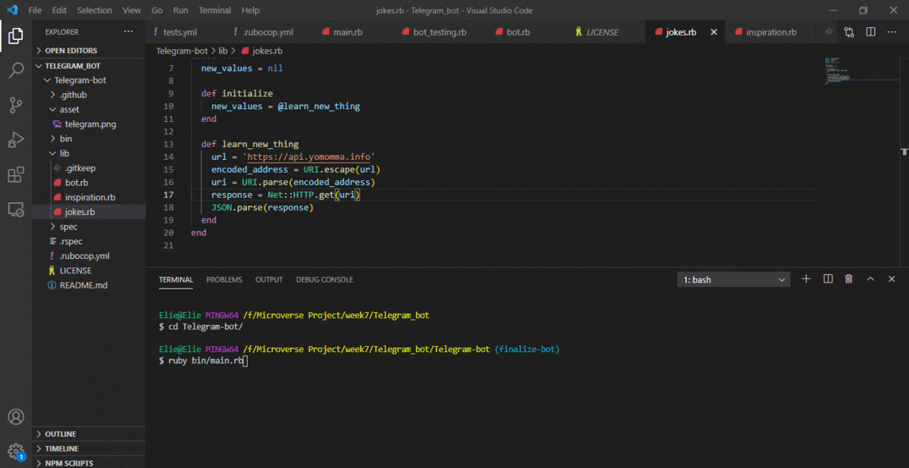

# `Telegram-inspirational--bot`

 > In this project, I built a Telegram Bot that gives you a daily inspirational quote and asks for your name and makes a joke about you. The main goal is to make a massive use of external API`s by putting into practice the main concepts of Object Oriented Programming, classes, modules, objects and accessing their attributes. The project is built using the TDD technique.

## `How to find the bot on Telegram`

- To find the bot on Telegram, simply download the [desktop](https://telegram.org/) application and on mobile got to the play store (for android) and search for telegram or apple store(for ISO) and download the application.

- Create a Telegram account and simply search for the Bot with the username `@emmyn5600bot`.

- Run the command to `/start` and enjoy using the bot.

- Click this [link!](https://web.telegram.org/#/im?p=@emmyn5600bot) to use the bot on the Browser.

## `You can see a short demo of the Bot /start command in the screenshot below`.

## `The available commands in the telegram bot`

- `/start` receive a greetings message with some explanation related to project.
- `/joke`  receive a joke API.
- `/inspiration` receive a sample for an inspiration.
- `/help`  receive help on commands.
- `/about`  receive info about the creator of the project.
- `/esconnect` receive the website I created.
- `/sleep` receive a warning that it is a mid-night.
- `/stop` receive a Good-bye message.
- `/map` receive a map location.

## `Built with`

-  2.7.2
- VS Code
- [Quotes API](https://type.fit/api/quotes)
- [Telegram API](https://core.telegram.org/api)
- [Jokes api](https://api.yomomma.info)
- RSpec
- Rubocop

## `Prerequisities`

To get this project up and running locally, you must have [Ruby](https://desktop.telegram.org/) installed on your computer.

**To get this project set up on your local machine, follow these simple steps:**

**Step 1** 
Navigate through the local directory where you want to clone the repository and run 
`git clone https://github.com/Emmyn5600/Telegram-inspirational--bot.git`. 
**Step 2** 
Run `cd Telegram-inspirational--bot` 
**Step 3** 
Change to the branch with the bot using `git checkout finalize-bot` 
**Step 4** 
Run `ruby bin/main.rb` to start the bot. 
**Step 5** 
You can use the commands defined in the Available commands section defined above. 

## `Repository Directories`

The code for the project is divided into the following directories: **./bin**, **./lib**, and **./spec**.

The **./bin** folder contains the executable **main.rb** file used to run a project.

The **./lib** folder contains subsidiary files that set up all of the classes used in bin/main.rb

- **bot.rb**, that holds all commands and token for the telegram bot.

- **inspiration.rb**, where the selected inspiration api is.

- **jokes.rb**, where the jokes api is.

The **./spec** folder contains all the relative spec tests

- **bot_testing.rb**, where the tests for the all methods are defined.

- **spec_helper.rb**, initial file generated by the RSpec.

In addition to the above, the repo also contains .rubocop.yml for linting.

## `Tests`

1. Open Your Terminal

2. Install RSpec on your system by running:

   `gem install rspec`

3. Run the tests with the command:

   `rspec spec/bot_testing.rb`

## Authors

👤 **NSABIMANA Emmanuel**

- GitHub: [@emmyn5600](https://github.com/Emmyn5600)
- Twitter: [@NSABIMA62253884](https://twitter.com/NSABIMA62253884)
- LinkedIn: [@nsabimana-emmanuel-4276091b2](https://www.linkedin.com/in/nsabimana-emmanuel-4276091b2/)

## 🤝 Contributing

Feel free to check the [issues page](https://github.com/Emmyn5600/Telegram-inspirational--bot/issues) to either create an issue or help us out by fixing an existing one.

## Show your support

If you like this project please give it a ⭐️!

## 📝 License

This project is licensed by Microverse and [MIT]
